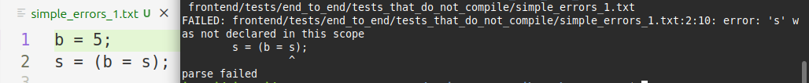
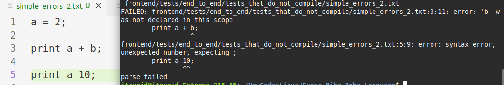

<div align="center">

# Реализация языка программирования "Biba-Boba-Buba language" на C++
  
  
  

</div>

- Данный проект представляет реализацию языка программирования `ParaCL` из курса C++ от К.И. Владимирова.

## README на других языках 

1. [Русский](/README-R.md)
2. [English](/README.md)

## Оглавление
Вступление:
- [Запуск программы](#запуск-программы)
- [Введение](#введение)
- [Методика](#методика)

Инструкция по использованию языка:
- [Описание возможностей языка](#описание-возможностей-языка)
- [Отображение ошибок компиляции](#отображение-ошибок-компиляции)
- [Переменные и числа](#переменные-и-числа)
- [Однострочные и многострочные комментарии](#однострочные-и-многострочные-комментарии)
- [Операторы ввода и вывода](#операторы-ввода-и-вывода)
- [Присваивание и цепочечное присваивание](#присваивание-и-цепочечное-присваивание)
- [Ветвления и циклы](#ветвления-и-циклы)
- [Локальные переменные и области видимости](#локальные-переменные-и-области-видимости)
- [Логические операторы](#логические-операторы)
- [Арифметические и битовые операторы](#арифметические-и-битовые-операторы)

Реализация фронтенда:
- [Реализация лексического анализатора](#реализация-лексического-анализатора)
- [Реализация синтаксического анализатора](#реализация-синтаксического-анализатора)
- [Реализация сборщика ошибок](#реализация-сборщика-ошибок)
- [Реализация областей видимости](#реализация-областей-видимости)
- [Реализация симулятора](#реализация-симулятора)

Дополнительно:
- [Использование dump](#использование-dump)
- [Структура проекта](#структура-проекта)
- [Авторы проекта](#авторы-проекта)

### Запуск программы
Клонирование репозитория, сборка и компиляция выполняется при помощи следующих команд:

```
git clone https://github.com/RTCupid/Biba_Boba_Buba_Language.git
cd Biba_Boba_Buba_Language
cmake -S . -B build -DCMAKE_BUILD_TYPE=Release
cmake --build build
```

Запуск программы производится в следующем формате:
```
./build/frontend/frontend <имя файла с программой>
```

## Введение
Разработка собственного языка программирования представляет собой фундаментальную задачу в компьютерных науках, позволяющую на практике исследовать принципы вычислений. Создание языка с C-подобным синтаксисом позволяет лучше понять архитектуру компиляторов. Этот процесс раскрывает внутреннюю логику трансляции высокоуровневых конструкций в промежуточные представления.

Ручная реализация лексического и синтаксического анализаторов сопряжена с существенными сложностями. Такой подход требует написания и отладки низкоуровневого кода, что особенно проблематично при модификации грамматики. Обработка приоритета операторов и ассоциативности становится нетривиальной задачей, делая поддержку языка чрезвычайно трудоёмкой.

Использование инструментов `Flex` и `Bison` позволяет автоматизировать создание анализаторов. `Flex` генерирует эффективный сканер на основе регулярных выражений, а `Bison` строит LALR(1)-парсер, выполняющий синтаксический анализ с опережающим просмотром в один токен. Этот подход значительно ускоряет разработку, обеспечивая надёжность и лёгкость модификации грамматики.

## Методика
Для описания грамматики подойдёт формат `РБНФ` [1]. Для генерации лексического и синтаксического анализаторов можно использовать `Flex` и `Bison`.
Для выполнения программы можно написать интерпретатор, который при помощи абстракции `Visitor'a` пройдёт по `AST` и просимулирует выполнение программы. 

## Описание возможностей языка

Составлена грамматика целевого языка программирования. Ниже приведено её описание в формате, близком к `РБНФ` [1]:

<details>
<summary>Грамматика</summary>
  
```
Program        ::= StmtList EOF

StmtList       ::= /* empty */ |  StmtList Statement 

Statement      ::= AssignmentStmt ';' | InputStmt ';' | IfStmt | WhileStmt | PrintStmt ';' | BlockStmt | ';'

BlockStmt      ::= '{' StmtList '}'
AssignmentStmt ::= Var '=' Expression
InputStmt      ::= Var '=' '?'
IfStmt         ::= 'if'    '(' Expression ')' Statement [ 'else' Statement ]
WhileStmt      ::= 'while' '(' Expression ')' Statement
PrintStmt      ::= 'print' Expression

Expression     ::= AssignmentExpr
AssignmentExpr ::= Or | Var '=' AssignmentExpr
Or             ::= And | Or '||' And
And            ::= BitwiseOp | And '&&' BitwiseOp
BitwiseOp      ::= Equality | BitwiseOp '&' Equality | BitwiseOp '^' Equality | BitwiseOp '|'  Equality
Equality       ::= Relational ( ( '==' | '!=' ) Relational )*
Relational     ::= AddSub ( ( '<' | '>' | '<=' | '>=' ) AddSub )*
AddSub         ::= MulDiv ( ( '+' | '-' ) MulDiv )*
MulDiv         ::= Unary  ( ( '*' | '/' ) Unary )*
Unary          ::= '-' Unary | '+' Unary | '~' Unary | Primary
Primary        ::= '(' Expression ')' | Var | Number

Var            ::= [A-Za-z_][A-Za-z0-9_]*
Number         ::= [1-9][0-9]* | '0'
EOF            ::= __end_of_file__
```

</details>

## Отображение ошибок компиляции
Фронтенд обеспечивает подробный `вывод ошибок`, который содержит информацию о файле, строке и позиции, где произошла ошибка. Также приводится описание ошибки, полностью выводится строка с ошибкой, и подчёркивается токен, не соответствующий правилам языка:

<details>
<summary>Простой пример вывода ошибки</summary>

<div align="center">
  
</div>

</details>

Во время синтаксического анализа собираются и выводятся все возможные ошибки. Для ошибок, которые произошли вследствие нарушения правил грамматики, предлагается исправление в соответствие с  правилами:

<details>
<summary>Пример множественного вывода ошибки и предложения исправления</summary>

<div align="center">
  
</div>

</details>

## Переменные и числа
`Переменные и числа` в языке имеют целочисленные значения. Переменные должны начинаться с буквы `[a-zA-Z_]`, затем может идти любое количество букв или цифр `[a-zA-Z0-9_]`. Числа начинаются с ненулевой цифры `[1-9]`, далее могут идти любые цифры `[0-9]`. Отдельно вынесено число `0`.

## Однострочные и многострочные комментарии
В языке поддержаны `комментарии двух типов: однострочные и многострочные`. Однострочные начинаются с символов `//` и заканчиваются `переносом строки`, многострочные начинаются с `/*`, заканчиваются `*/`:

<details>
<summary>Комментарии</summary>

```C
/* Программа для расчёта траектории
   приземления на поверхность звезды */

T = 38966; // К, температура звезды
```

</details>

## Операторы ввода и вывода
Реализованы `операторы ввода и вывода`. Оператор вывода характеризуется ключевым словом `print` и ожидает после себя выражение, заканчивающееся `;`, результат выражения выводится в `std::cout`. Оператор ввода записывается при помощи ключевого слова `?`, он может применяться в любых местах, где подходит использование числа, во время выполнения программы число будет взято из `std::cin`: 

<details>
<summary>Пример: операторы ввода и вывода</summary>

```C
a = ?;
print a;
```

После запуска программы будет запрошен пользовательский ввод, и введённое число будет выведено в `std::cout`.

</details>

## Присваивание и цепочечное присваивание
`Оператор присваивания`, который позволяет объявлять и определять переменные, может использоваться как в качестве отдельного оператора, так и в качестве выражения, результатом которого является значение, записываемое в переменную. Это позволяет использовать присваивание в других выражениях, а также реализовать так называемое `цепочечное присваивание`:

<details>
<summary>Пример: присваивание и цепочечное присваивание</summary>

```C
i = 2 + (j = 1 + (k = 1));
print k; // 1
print j; // 2
print i; // 4
```

</details>

## Ветвления и циклы
В языке реализованы ветвления и циклы. Ветвления позволяют проверить результат выражения и выполнить действия в зависимости от него. Для этого используется ключевое слово `if`, за которым идёт выражение в круглых скобках. Затем пишется либо одиночный оператор, который выполнится в случае ненулевого результата выражения, либо блок из операторов в фигурных скобках. После этого аналогично можно добавить блок `else`, который будет выполнен в случае, когда результат нулевой. Таким образом можно записать структуру ветвления так: 'if' '(' Expression ')' Statement [ 'else' Statement ].

<details>
<summary>Пример: ветвление</summary>

```C
a = ?;

if (a) {
  print 100/a;
} else {
  print 999;
  print -999;
}
```

Если на `std::cin` придёт ненулевое число, то в `std::cout` выведется результат частного `100/a`, иначе выведется два числа `999` и `-999`.

</details>

Циклы строятся аналогичным образом: используется ключевое слово `while` с последующим выражением в скобках, за которым идёт одиночный оператор, либо блок из операторов, которые повторяются, пока выражение в скобках не равно нулю. Получается следующая структура для циклов: 'while' '(' Expression ')' Statement.

<details>
<summary>Пример: цикл</summary>

```C
a = ?;
while (a) {
  print a;
  a = ?;
}
```

Пока на `std::cin` подаются ненулевые числа - эти числа перенаправляются на `std::cout`, когда на вход придёт `0`, цикл прервётся.

</details>

## Локальные переменные и области видимости
Во фронтенде обрабатываются `области видимости переменных`. С начала программы существует глобальная область видимости. При заходе в новый блок кода создаётся соответствующая ему область видимости, также изнутри доступны внешние области видимости. После выхода из блока кода удаляется его область видимости и переменные, которые были объявлены в нём:

<details>
<summary>Пример: локальные переменные</summary>

```C
a = 5;

if (a) {
  b = 999;
  print a; // корректно
  print b; // корректно
}

print b; // ошибка, переменная b не определена в этой области видимости
```

</details>

## Логические операторы
В языке есть поддержка логических операторов `&&` - логическое "и", `||` - логическое "или", `!` - логическое "не". Эти операторы применяются к выражениям, их результатом является `1` или `0` в зависимости от комбинации нулевых и ненулевых выражений. Первые два являются бинарными, последний - унарный.

<details>
<summary>Пример: логические операторы</summary>

```C
a = 4;
b = 5;

if (a == 4 && b == 5) {
    print 1; // верно
} else {
    print 0;
}

if (a == 5  /* неверно */ || !(b == 4) /* верно, так как b не равно 4*/) {
    print 1; // верно
} else {
    print 0;
}
```

В результате будет выведено: `11`.

</details>

## Арифметические и битовые операторы
Также в языке присутствуют все арифметические: `+`, `-`, `*`, `/`, унарный `-`, унарный `+`, и битовые операторы: `|`, `^`, `&`, `~`, а также операторы сравнения: `>`, `<`, `=`, `>=`, `<=`, `==`, `!=`.

<details>
<summary>Пример: арифметические операторы - расчёт чисел Фиббоначи</summary>

```C
fst = 0; 
snd = 1;
number = ?;

while (number > 1) {
    tmp = fst;
    fst = snd;
    snd = snd + tmp;

    number = number - 1;
}

print snd;
```

В результате будет выведено n-е число Фиббоначи, где n - число из `std::cin`.

</details>

<details>
<summary>Пример: битовые операторы - базовые операции</summary>

```C
a = 12; // 1100 in binary
b = 10; // 1010 in binary

result_and = a & b;
expected_and = 8; // 1000 in binary
if (result_and == expected_and) {
    print 1;
} else {
    print 0;
}

result_or = a | b;
expected_or = 14; // 1110 in binary
if (result_or == expected_or) {
    print 1;
} else {
    print 0;
}

result_xor = a ^ b;
expected_xor = 6; // 0110 in binary
if (result_xor == expected_xor) {
    print 1;
} else {
    print 0;
}
```

В результате будет выведено: `111`.

</details>


## Реализация лексического анализатора
Реализована генерация лексического анализатора при помощи `Flex` (см. [lexer.l](https://github.com/RTCupid/Super_Biba_Boba_Language/blob/main/frontend/src/lexer.l)).

Определены:

<details>
<summary>лексические конструкции и правила для их обработки</summary>

```l
WHITESPACE    [ \t\r\v]+
ID            [a-zA-Z_][a-zA-Z0-9_]*
NUMBER        [0-9]+
NUMBER1       [1-9]+
ZERO          0
LINE_COMMENT  "//".*
BLOCK_COMMENT "/*"([^*]|\*+[^*/])*\*+"/"
NEWLINE  \n

%%

{WHITESPACE}    { yycolumn += yyleng; }
{NEWLINE}       { ++yylineno; yycolumn = 1; }

{LINE_COMMENT}  { yycolumn += yyleng; }
{BLOCK_COMMENT} { /* skip */ }

"if"            { yycolumn += yyleng; return process_if();   }
"else"          { yycolumn += yyleng; return process_else(); }
"while"         { yycolumn += yyleng; return process_while(); }
"print"         { yycolumn += yyleng; return process_print(); }
"?"             { yycolumn += yyleng; return process_input(); }

"||"             { yycolumn += yyleng; return process_log_or(); }
"&&"             { yycolumn += yyleng; return process_log_and(); }

"!"             { yycolumn += yyleng; return process_not(); }
"=="            { yycolumn += yyleng; return process_eq(); }
"!="            { yycolumn += yyleng; return process_not_eq(); }
"<="            { yycolumn += yyleng; return process_less_or_eq(); }
">="            { yycolumn += yyleng; return process_greater_or_eq(); }
"="             { yycolumn += yyleng; return process_assign(); }

"+"             { yycolumn += yyleng; return process_plus(); }
"-"             { yycolumn += yyleng; return process_minus(); }
"*"             { yycolumn += yyleng; return process_mul(); }
"/"             { yycolumn += yyleng; return process_div(); }
"%"             { yycolumn += yyleng; return process_rem_div(); }
"&"             { yycolumn += yyleng; return process_and(); }
"^"             { yycolumn += yyleng; return process_xor(); }
"|"             { yycolumn += yyleng; return process_or(); }

"<"             { yycolumn += yyleng; return process_less(); }
">"             { yycolumn += yyleng; return process_greater(); }

"("             { yycolumn += yyleng; return process_left_paren(); }
")"             { yycolumn += yyleng; return process_right_paren(); }
"{"             { yycolumn += yyleng; return process_left_brace(); }
"}"             { yycolumn += yyleng; return process_right_brace(); }
";"             { yycolumn += yyleng; return process_semicolon(); }

{NUMBER1}{NUMBER}* { yycolumn += yyleng; return process_number(); }
{ZERO}          { yycolumn += yyleng; return process_number(); }

{ID}            { yycolumn += yyleng; return process_id(); }

.               {
                    std::cerr << "Unknown token: '" << yytext << "' at line " << yylineno << std::endl;;
                    return -1;
                }

<<EOF>>         { return 0; }

%%
```

</details>

Функции для обработки лексем определены в классе `Lexer`, который наследуется от
`yyFlexLexer`(см. [lexer.hpp](https://github.com/RTCupid/Super_Biba_Boba_Language/blob/main/frontend/include/lexer.hpp)).
Они возвращают соответствующий token парсера, который генерирует `Bison`, это сделано для совместной работы `Bison` и `Flex`.

Для вывода полной информации об ошибке в класс `Lexer` добавлены: 

<details>
<summary>функции для получения локации токена</summary>

```C++
int get_line() const { return yylineno; }

int get_column() const { return yycolumn; }

int get_yyleng() const { return yyleng; }
```

</details>

## Реализация синтаксического анализатора
Для синтаксического анализа добавлен класс `My_parser` (см. [my_parser.hpp](https://github.com/RTCupid/Super_Biba_Boba_Language/blob/main/frontend/include/my_parser.hpp)). Он наследуется от `yy::parser`, который генерируется при помощи `Bison` (см. [parser.y](https://github.com/RTCupid/Super_Biba_Boba_Language/blob/main/frontend/src/parser.y)), и содержит следующие поля и методы:

<details>
<summary>класс My_parser</summary>
  
```C++
class My_parser final : public yy::parser {
  private:
    Lexer *scanner_;
    std::unique_ptr<Program> root_;
    std::vector<std::string> source_lines_;

  public:
    Error_collector error_collector;
    Scope scopes;

    My_parser(Lexer *scanner, std::unique_ptr<language::Program> &root,
              const std::string &program_file)
        : yy::parser(scanner, root, this), scanner_(scanner),
          root_(std::move(root)), error_collector(program_file) {
        read_source(program_file);
    }
    ...
};
```

</details>

Функция, через которую осуществляется взаимодействие парсера с лексером:

<details>
<summary>функция yylex</summary>

```C++
int yylex(yy::parser::semantic_type* yylval,
          yy::parser::location_type* yylloc,
          language::Lexer*           scanner) {
  int line_before = scanner->get_line();

  auto tt = scanner->yylex();

  yylloc->begin.line = line_before;
  yylloc->begin.column = scanner->get_column() - scanner->get_yyleng();
  yylloc->end.line = scanner->get_line();
  yylloc->end.column = scanner->get_column();

  if (tt == yy::parser::token::TOK_NUMBER)
      yylval->build<int>() = std::stoi(scanner->YYText());

  if (tt == yy::parser::token::TOK_ID)
      yylval->build<std::string>() = scanner->YYText();

  return tt;
}
```

Для чисел и переменных сохраняется значение в `yylval`, в остальных случаях возвращается тип токена.

</details>

Во время синтаксического анализа строится `AST` (abstract-syntax-tree). 
При помощи введения новых правил для синтаксического анализа реализована иерархия порядка исполнения.

## Реализация сборщика ошибок
Для сбора ошибок реализован сборщик `Error_collector` (см. [error_collector.hpp](https://github.com/RTCupid/Super_Biba_Boba_Language/blob/main/frontend/include/error_collector.hpp)).

Внутри себя он хранит `std::vector` с информацией о каждой ошибке:

<details>
<summary>структура Error_info</summary>

```C++  
struct Error_info {
  const std::string program_file_;
  const yy::location loc_;
  const std::string msg_;
  const std::string line_with_error_;

  Error_info(const std::string program_file, const yy::location &loc,
             const std::string &msg, const std::string &line_with_error)
      : program_file_(program_file), loc_(loc), msg_(msg),
        line_with_error_(line_with_error) {}

  Error_info(const std::string program_file, const yy::location &loc,
             const std::string &msg)
      : program_file_(program_file), loc_(loc), msg_(msg) {}

  void print(std::ostream &os) const {
      ...
  }
};
```

</details>

А также содержит методы для добавления и вывода ошибок:

<details>
<summary>методы Error_collector</summary>

```C++
void add_error(const yy::location &loc, const std::string &msg,
               const std::string &line_with_error) {
    errors_.push_back(Error_info{program_file_, loc, msg, line_with_error});
}

void add_error(const yy::location &loc, const std::string &msg) {
    errors_.push_back(Error_info{program_file_, loc, msg});
}

bool has_errors() const { return !errors_.empty(); }

void print_errors(std::ostream &os) const {
    if (!errors_.empty())
        for (auto &error : errors_)
            error.print(os);
}
```

</details>

`My_parser` содержит поле `Error_collector`, что позволяет добавлять ошибки прямо во время синтаксического анализа при помощи функции `error`:

<details>
<summary>функция error</summary>

```C++
void yy::parser::error(const location& loc, const std::string& msg) {
    my_parser->error_collector.add_error(loc, msg, my_parser->get_line_content(loc.begin.line));
  }
```

</details>

## Реализация областей видимости
Для поддержки локальных переменных добавлен класс `Scope` (см. [scope.hpp](https://github.com/RTCupid/Super_Biba_Boba_Language/blob/main/frontend/include/scope.hpp)), который хранит вектор из таблиц имён для каждой области видимости и имеет методы для добавления новых и удаления крайних добавленных областей видимости, а также для поиска переменной по имени во всех доступных в данной точке программы областях:

<details>
<summary>класс Scope</summary>

```C++
class Scope final {
  private:
    std::vector<nametable_t> scopes_;

  public:
    Scope() {
        push(nametable_t{}); // add global scope
    }

    void push(nametable_t nametable) { scopes_.push_back(nametable); }

    void pop() { scopes_.pop_back(); }

    void add_variable(name_t &var_name, bool defined) {
        assert(!scopes_.empty());
        scopes_.back().emplace(var_name, defined);
    }

    bool find(name_t &var_name) const {
        for (auto it = scopes_.rbegin(), last_it = scopes_.rend();
             it != last_it; ++it) {
            auto var_iter = it->find(var_name);
            if (var_iter != it->end())
                return true;
        }

        return false;
    }
};
```

</details>

Экземпляр класса `Scope` хранится в классе `My_parser` и используется для проверки наличия переменной в области видимости в процессе синтаксического анализа.  

## Реализация симулятора
Чтобы симулировать выполнение программы, реализован класс `Simulator` (см. [simulator.hpp](https://github.com/RTCupid/Super_Biba_Boba_Language/blob/main/frontend/include/simulator.hpp)), наследующийся от абстрактного класса `ASTVisitor`:

<details>
<summary>класс ASTVisitor</summary>
  
```C++
class ASTVisitor {
  public:
    virtual ~ASTVisitor() = default;

    virtual void visit(Program &node) = 0;
    virtual void visit(Block_stmt &node) = 0;
    virtual void visit(Empty_stmt &node) = 0;
    virtual void visit(Assignment_stmt &node) = 0;
    virtual void visit(Assignment_expr &node) = 0;
    virtual void visit(Input &node) = 0;
    virtual void visit(If_stmt &node) = 0;
    virtual void visit(While_stmt &node) = 0;
    virtual void visit(Print_stmt &node) = 0;
    virtual void visit(Binary_operator &node) = 0;
    virtual void visit(Unary_operator &node) = 0;
    virtual void visit(Number &node) = 0;
    virtual void visit(Variable &node) = 0;
};
```

</details>

В классе `Simulator` выполняется переопределение виртуальных функций `ASTVisitor`, а также вводится функция для вычисления выражений, которая использует специальный класс `ExpressionEvaluator` (см. [expr_evaluator.hpp](https://github.com/RTCupid/Super_Biba_Boba_Language/blob/main/frontend/include/expr_evaluator.hpp)):

<details>
<summary>функция evaluate_expression</summary>

```C++
number_t Simulator::evaluate_expression(Expression &expression) {
    ExpressionEvaluator evaluator(*this);
    expression.accept(evaluator);
    return evaluator.get_result();
}
```

</details>

`ExpressionEvaluator` специализируется только на вычислении выражений, содержит поле `result_` для сохранения результата выражения, а также `simulator_` - 
ссылку на симулятор, из которого он был вызван, чтобы иметь доступ к таблице имён.

## Использование dump
Для включения опции графического дампа дерева нужно выставить флаг -GRAPH_DUMP, который по умолчанию отключен
```bash
cmake -S . -B build -DGRAPH_DUMP=ON
```
Построенное дерево `AST` можно посмотреть в графическом представлении при помощи `graphviz`. Для генерации изображения можно ввести
```bash
dot dot dump/dump.gv -Tsvg -o dump/dump.svg
```
Получится следующее представление дерева

<details>
<summary>пример сгенерированного AST</summary>
  
<div align="center">
  
</div>

</details>

## Структура проекта

<details>
<summary>Структура проекта</summary>

```
├── build
├── CMakeLists.txt
├── contribution_guidelines.md
├── frontend
│   ├── CMakeLists.txt
│   ├── include
│   │   ├── ast_factory.hpp
│   │   ├── config.hpp
│   │   ├── driver.hpp
│   │   ├── dump_path_gen.hpp
│   │   ├── error_collector.hpp
│   │   ├── expr_evaluator.hpp
│   │   ├── lexer.hpp
│   │   ├── my_parser.hpp
│   │   ├── node.hpp
│   │   ├── scope.hpp
│   │   └── simulator.hpp
│   ├── src
│   │   ├── driver.cpp
│   │   ├── expr_evaluator.cpp
│   │   ├── graph_dump.cpp
│   │   ├── lexer.l
│   │   ├── main.cpp
│   │   ├── parser.y
│   │   └── simulator.cpp
│   └── tests
│       ├── CMakeLists.txt
│       ├── end_to_end
│           └── ...
│       └── unit
│           └── ...
├── img
│   └── ...
├── LICENSE
├── README.md
└── README-R.md

```

</details>

## Авторы проекта

<div align="center">

  <a href="https://github.com/RTCupid">
    
  </a>
  <a href="https://github.com/BulgakovDmitry">
    
  </a>
  <a href="https://github.com/lavrt">
    
  </a>
  <br>
  <a href="https://github.com/RTCupid"><strong>@RTCupid, </strong></a>
  <a href="https://github.com/BulgakovDmitry"><strong>@BulgakovDmitry, </strong></a>
  <a href="https://github.com/lavrt"><strong>@lavrt</strong></a>
  <br>
</div>

## 📚 Литература
1. Расширенная форма Бэккуса-Науэра [Электронный ресурс]: статья. -  https://divancoder.ru/2017/06/ebnf/ (дата обращения 21 мая 2025)

